<div align="center">

# AgentFormation

**Private, persistent coding-agent workspaces in your AWS account.**

<p>
  <a href="https://github.com/BlockchainCap/AgentFormation/actions/workflows/checks.yml"></a>
  <a href="LICENSE"></a>
  <a href="SECURITY.md"></a>
</p>

<p>Each approved employee gets one private EC2 runtime and a persistent <code>/workspace</code>—with company SSO and no inbound SSH.</p>

<p><a href="#quick-start">Quick start</a> · <a href="#architecture">Architecture</a> · <a href="#documentation">Documentation</a> · <a href="#security-model">Security</a> · <a href="CONTRIBUTING.md">Contributing</a></p>

</div>

<p align="center">
  
</p>

AgentFormation gives each approved employee a private EC2 workspace with both
[Claude Code](https://docs.anthropic.com/en/docs/claude-code) and
[Codex](https://developers.openai.com/codex/) configured for Amazon Bedrock. A
small web app provides browser terminals, persistent `tmux` sessions, and file
uploads. Everything runs in an AWS account you control.

Employees sign in with the same AWS IAM Identity Center account they already use
for company AWS access. AgentFormation does not keep a separate username,
password, or authenticator-app setting. An administrator normally assigns a
dedicated AgentFormation access group to the app, and each assigned employee can
create exactly one reviewed coding environment for themself.

| Company sign-in | Private by default | Persistent by design |
| --- | --- | --- |
| IAM Identity Center; no second app password | Private subnet, encrypted EBS, no public IP, and no inbound SSH | `/workspace` and `tmux` keep running after the browser disconnects |

> [!IMPORTANT]
> The first complete deployment builds a runtime image and an App Runner service.
> It commonly takes more than 30 minutes. This is normal for the AWS services used
> by the template, not a frozen terminal.

## Architecture

```text
assigned employee group
        |
        v
AWS IAM Identity Center --SAML--> Cognito bridge --OIDC--> App Runner
                                                           web terminal
                                                                |
                                            Create environment  |
                                                                v
                                                restricted setup job
                                                                |
                                                                v
                                                private EC2 runtime
                                          Claude Code + Codex + /workspace
                                                                |
                                                                v
                                                    Amazon Bedrock models
```

- IAM Identity Center group assignment as the only employee sign-in
- Amazon Cognito as an invisible SAML-to-OIDC bridge, with local sign-in excluded
- one private VPC subnet and one NAT gateway by default
- one private, encrypted EC2 runtime and EBS volume per employee
- AWS Systems Manager Session Manager instead of inbound SSH
- an EC2 Image Builder pipeline with pinned Claude Code and Codex versions
- pinned AWS CLI, Node.js, and Bun versions for repeatable project setup
- an App Runner web terminal
- a restricted Step Functions job that can create only the reviewed runtime stack
- a DynamoDB identity-to-runtime registry
- a short-lived, encrypted S3 upload staging area

You need an organization instance of IAM Identity Center, permission to add a
customer-managed SAML application and assign a group, an AWS CLI profile that can
deploy the resources, Docker with `buildx`, `jq`, and access to the selected
Bedrock models. The AWS root user is deliberately not an app login. Root is a
separate emergency identity and should not be used for daily work.

Before deploying, follow the
[workstation setup guide](docs/workstation-setup.md) to install the correct AWS
CLI and Docker tools for macOS or Linux on `amd64`/`x86_64` or
`arm64`/`aarch64`. It also explains why the AWS account permission set used by
the CLI is separate from the Identity Center group assigned to the
AgentFormation application. For a guided, read-only setup, start Codex from this
repository and invoke `$setup-agentformation`.

AWS does not expose customer-managed SAML application creation or attribute
mapping through its public CLI, API, or CloudFormation resource. Creating the
Identity Center application and entering its two attribute mappings is therefore
a one-time console step; AgentFormation automates the Cognito side and the rest of
the deployment.

If CloudFormation must use an existing service role, add its ARN as
`cloudFormationRoleArn` in `agentformation.local.json`. The example omits it
because not every account requires one.

## Quick start

1. Clone the repository and create the private local configuration:

   ```bash
   cp agentformation.example.json agentformation.local.json
   AWS_PROFILE=your-profile ./agentformation doctor
   AWS_PROFILE=your-profile ./agentformation deploy
   ```

   The first deploy creates only enough identity infrastructure to print the
   exact SAML ACS URL and audience, then exits successfully.

   Use the [configuration guide](docs/configuration.md) for every field, moving
   an older config, or continuing the same deployment from another computer.

2. In IAM Identity Center, create a customer-managed SAML 2.0 application using
   those two printed values. Map SAML `Subject` to `${user:subject}` with the
   `persistent` format, map `email` to `${user:email}` with the `unspecified`
   format, assign a dedicated AgentFormation access group, add one test employee
   directly to that group, and
   copy the HTTPS address shown for the **IAM Identity Center SAML metadata
   file**. Using the address lets Cognito refresh signing certificates
   automatically. If your console offers only a download, save the XML file
   instead.

3. Put the metadata address in the ignored private config and deploy again. Do
   not commit the organization-specific address:

   ```bash
   # In agentformation.local.json, set identityCenter.metadataUrl to the HTTPS
   # address from IAM Identity Center and leave metadataFile empty.
   AWS_PROFILE=your-profile ./agentformation doctor
   AWS_PROFILE=your-profile ./agentformation deploy
   ```

   If you downloaded XML instead, save it as
   `.agentformation/identity-center-metadata.xml`, leave `metadataUrl` empty, and
   set `metadataFile` to that path. Set only one metadata source.

4. Open the printed web address and choose **Continue with company SSO**. If your
   company SSO session is still active, there is normally no second prompt. Choose
   **Create environment** once; the reviewed AWS job creates your private runtime.

5. When a command-line tool opens a browser login that ends at
   `127.0.0.1` or `localhost`, the browser will show
   `ERR_CONNECTION_REFUSED`. This is expected for a remote runtime. Copy the
   complete failed address, return to AgentFormation, choose **Finish login**,
   paste it, and choose **Send to runtime** while the CLI is still waiting. Never
   paste that one-time address into chat or logs. Follow the
   [remote CLI sign-in guide](docs/remote-cli-login.md) for the complete flow and
   troubleshooting steps.

6. As the optional final setup step, migrate a person's existing Codex and Claude
   Code preferences or approved session history into their assigned runtime. Start
   Codex from this repository and invoke `$migrate-agent-configs`; it begins with a
   read-only inventory and requires separate approval before moving credentials or
   chats. A complete migration maps the copied chat index to the remote workspace
   so ordinary `codex resume` and the in-app `/resume` command work. Use
   `codex resume --all --include-non-interactive -C /workspace` as the all-folders
   fallback. Follow the
   [local agent migration guide](docs/migrating-local-agent-configs.md).

See [the complete IAM Identity Center setup guide](docs/identity-center-setup.md)
for the exact console fields and group-assignment steps.

The deploy command is safe to run again. CloudFormation applies reviewed changes
without creating a second runtime for an existing company identity. The latest
tested AMI is reused; set `AGENTFORMATION_REBUILD_IMAGE=1` only when you
intentionally want a fresh image with otherwise unchanged settings.

### Custom web address

App Runner supplies a working HTTPS address automatically. To use a company
address instead, first associate that custom domain with the App Runner service
and publish the certificate-validation and traffic records requested by App
Runner through your DNS provider. Wait until App Runner reports the domain as
active, then put only the origin in the ignored local configuration:

```json
"publicUrl": "https://agents.example.com"
```

Run `./agentformation doctor` and `./agentformation deploy` again. The deploy
command uses that address for Auth.js, Cognito callbacks and logout, browser
upload restrictions, and status output. Do not commit a company hostname to the
public repository. Leave `publicUrl` empty to keep using the generated App Runner
address.

## Documentation

| Guide | Use it for |
| --- | --- |
| [Workstation setup](docs/workstation-setup.md) | Installing the AWS CLI and Docker on macOS or Linux, including `amd64` and `arm64` differences |
| [IAM Identity Center setup](docs/identity-center-setup.md) | Creating the SAML application, attribute mappings, and assigned access group |
| [Configuration and upgrades](docs/configuration.md) | Choosing settings, moving a deployment, rebuilding images, and applying updates |
| [Remote CLI sign-in](docs/remote-cli-login.md) | Finishing `localhost` or `127.0.0.1` OAuth callbacks from a browser terminal |
| [Agent config migration](docs/migrating-local-agent-configs.md) | Moving approved Codex or Claude Code preferences and history into a runtime |
| [Security model](docs/security-model.md) and [privacy notes](docs/privacy.md) | Understanding trust boundaries, access, stored data, and operational responsibilities |

## Daily administration

```bash
# Show shared stacks, employee runtimes, and the web address
AWS_PROFILE=your-profile ./agentformation status

# Immediately block app sign-in and stop compute while preserving the disk
AWS_PROFILE=your-profile ./agentformation users disable --email person@example.com

# Restore app sign-in and restart the preserved runtime
AWS_PROFILE=your-profile ./agentformation users enable --email person@example.com

# Permanently delete the app identity, runtime, and runtime disk
AWS_PROFILE=your-profile ./agentformation users purge \
  --email person@example.com --confirm DELETE

# Permanently delete the complete deployment
AWS_PROFILE=your-profile ./agentformation destroy --confirm DELETE
```

Group assignment in IAM Identity Center is the source of truth. Remove an
employee from the assigned group when access should end. Use `users disable` for
an immediate app-side block that preserves their disk. Remove the group assignment
before `users purge`; otherwise the still-approved employee can sign in again and
create a new environment.

Users start in `/workspace`. Closing a browser does not kill the `tmux` session,
so reconnecting returns to the same terminal process.

New environments include Git, Docker, Node.js/npm, Bun, `jq`, `ripgrep`, and
`tmux` alongside Claude Code and Codex. A rebuilt image applies to environments
created afterward; it does not silently replace an existing employee's
persistent machine. See the [configuration and upgrade guide](docs/configuration.md).

## Security model

AgentFormation isolates ordinary app users from one another, but the AWS account
administrator remains trusted and can inspect or change all resources. The
browser cannot choose an instance ID. The server uses the signed-in federated
Cognito subject to find the assigned runtime, and the setup job accepts only a
fixed, content-hashed CloudFormation template and fixed operator-selected values.
Runtimes have no public IP and no inbound security group rules.

Read [the security model](docs/security-model.md) and
[the privacy notes](docs/privacy.md) before assigning users. To report a
vulnerability, follow [SECURITY.md](SECURITY.md).

## Cost and cleanup

This is not a free-tier-only template. The main costs are App Runner, a NAT
gateway, one EC2 instance and EBS volume per user, Image Builder, Step Functions,
S3, DynamoDB, and Bedrock requests. Check the
[AWS Pricing Calculator](https://calculator.aws/) for your region and sizes.
Disabling a user stops EC2 compute but preserves EBS storage. Use `purge` or
`destroy` when data is no longer needed.

## Development

Prepare the pinned tools and understand the host-versus-container architecture
using the [workstation setup guide](docs/workstation-setup.md), then run:

```bash
./scripts/check.sh
```

The check runs the frozen install, dependency audit, formatting, lint, types,
tests, production build, shell checks, and CloudFormation lint. Pull requests do
not receive AWS credentials. A full AWS deployment remains a maintainer-run check
because it creates billable resources and uses account-specific Bedrock access.

See [CONTRIBUTING.md](CONTRIBUTING.md) and the
[maintainer release checklist](docs/maintainer-release-checklist.md).

## Support and license

AgentFormation is a community reference project. There is no guaranteed support
or uptime commitment. Bugs and improvements are welcome through GitHub issues and
pull requests.

Licensed under the [BSD 2-Clause License](LICENSE).
